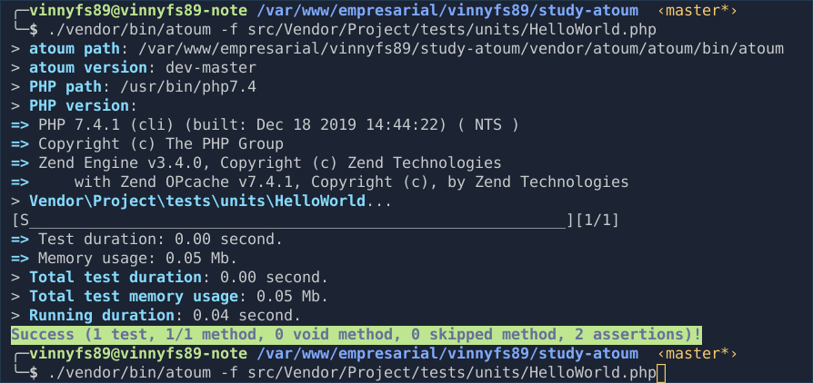

# Study case of php Atoum

Study of Atoum PHP Unit Test.

## Test

- In project root folder type the code `./vendor/bin/atoum -f src/Vendor/Project/tests/units/HelloWorld.php`

Output need to be something like this:

## References

- [Atoum Docs](http://docs.atoum.org/en/latest)
